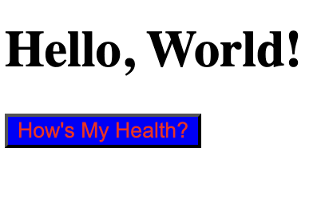

# The Basics
Before making fancy buttons or overall design, in this section I will try to write about 
my reasoning for choosing the technologies I did.

## General Design
1. Why JS?
I have decided to use vanilla JS for this project. THe project should not have too much front 
end and I want it to be as educational as possible. I know there are alternatives to JS...
like the millions and millions of daily frameworks. But while frameworks make things "easier"
they come with a heavy tradeoff cost. So, no thank you to that, I want to simply learn JS for 
all of its flaws so I know what it is I am building and why.

2. Why Go?
There are many good backends out there, Rust, Kotlin, and even Ocaml come to mind, but I 
choose Golang. Golang is a progamming language I have been spending a lot of time with, thus,
its time to use some Golang in a in the wild style project.

3. What are we doing then?
For now I want to simply set up my frontend to my backend. I will be making a SSR app that will
take information from the user via a query and process it back to the client. This means the JS 
will soley be responsible for DOM manipulation.

## Testing
This was a health check so there was not really a need to "test" as the end point of this section
was indeed to test that the front end could make a request to the server. But here was the idea. 
I wanted a button that sent a GET request to my Golang server. Now, Golang has a great stdlib, 
so there was no reason to use a framework or anything, however I really wanted to 

## Problems
1. This was difficult for a myriad of reasons but I will write some of the biggest ones here.

- What Server do I need?

When it comes to making a full stack app you need to both have a client and a server. Typically, 
if you work in node or something like that, there is a server runtime for you that does all the
stuff you need because you are working on the client side...but I needed to connect my Golang 
with my amazing website (that says hello world and has a button). 

So, with Golang, I ran a MuxServer using the Stdlib, and set a Handler up called Health check.
Pretty easy if you ask me, like all things Golang. You can see the code setup here.

```Go

package main

import (
	"net/http"
	"log"
)

// apiConfig Struct
type apiConfig struct {}

func main () {
	const apiPath = "/api"
	const port = "8081"
    
    // Here it is the beautiful server!
	server := http.NewServeMux()
    
	server.HandleFunc(apiPath+"/healthz", healthCheck) // Don't worry healthCheck exists in a health_check.go file
	
	cfg := apiConfig{}

    // We will get to this function later...
	handler := cfg.CorsMiddleware(server)
	
	localSever := &http.Server{
		Handler: handler,
		Addr:    ":" + port,
	}

	log.Printf("Serving on port %s\n", port)
	log.Fatal(localSever.ListenAndServe())
}
```

You will notice with Golang, I have an apiConfig, that will do things like help with making dev environment 
variables, and other things like a db connection. For now, I will use it to call my CORS function...yes that is
right, turns out just like all Frontend Backend Projects, my Backend said NO THANK YOU to the JS GET request
coming in, but really any requests that aren't at a specified port. 

So what does the CORS middleware do...welllll

CORS stands for Cross-Origin Resource Sharing. It makes a specified origin that is permitted to loading resources.
What the hell does that mean. Basically, we don't want requests from unauthorized ports on our computer, or 
malicious actors. a CORS handler in this case designates where the communication of resources come from. In our
case, we share our frontend port with our backend port so they may communicate with one another. 

What does this look like in Golang?
```Go

func (cfg * apiConfig) CorsMiddleware(next http.Handler) http.Handler {
    return http.HandlerFunc(func(w http.ResponseWriter, r *http.Request) {
        w.Header().Set("Access-Control-Allow-Origin", "http://127.0.0.1:8080")
        w.Header().Set("Access-Control-Allow-Methods", "GET, POST, PUT, DELETE, OPTIONS")
        w.Header().Set("Access-Control-Allow-Headers", "Content-Type")

        if r.Method == "OPTIONS" {

            w.WriteHeader(http.StatusOK)
            return
        }
        next.ServeHTTP(w,r)     
    })
}
```

Pretty simple, Now we know that the Origin (location of the client port), is at a specific domain. Methods 
are REST API oriented, so GET, POST, DELETE, and OPTIONS. Wait...what is OPTIONS??

"OPTIONS is a special HTTP method that browsers automatically send as a "preflight" request before 
certain types of HTTP requests (like POST, PUT, or DELETE). It's like a scout checking if it's safe 
to proceed!"

So lets say we make a "BLUEDOG" request, now hopefully it should fail but if it doesn't the OPTIONS tag can 
catch it out.

...Now then to JS!


- What the JS??
Now let me tell you, I am an expert Front End Specialist...and by that I mean I made a blue button. The goal
of this project will be to keep all css and JS vanilla, because quite frankly I don't like the idea of learning
with frameworks, until I have learned with the language itself. No need for sugar until I have eaten my veggies.

So what does my amazing project look like...


..........Beautiful I know. 


BUT It does connect to the backend! How you ask well that handcrafted button responds to a main.js script.
```HTML
    <button type="button" class="HealthCheck">How's My Health?</button>
```
Just so we are alllll clear, this is the button located in the `<body></body>` section of `index.html`.
Pretty easy and efficient here.

But how can we make the button...do stuff. Well we first need to make sure that we query the correct part of
the DOM. That would be `.HealthCheck`, the classname we have given to button. Because we are going to await 
a response from the server. 

```JS
document.addEventListener('DOMContentLoaded', () => {
	const button = document.querySelector('.HealthCheck');
	button.addEventListener('click', async () => {
		// Here we will send the on click 
		console.log('Button Clicked');
		await sendHealthCheck();
	});
});
```

Great! But what is that sendHealthCheck()........

```JS
async function sendHealthCheck() {

	try {
		const response = await fetch('http://127.0.0.1:8081/api/healthz');
		if (!response.ok) 
			throw new Error(`HTTP error! status ${response.status}`);

		const data = await response.text();
		console.log('Success:', data);
	}
	catch (error) {
		console.error('Error:', error);
	}
};
```


Yes, that is correct that function which is triggered when the DOM selects the `.HealthCheck` then sends 
the check directly to the endpoint. This can of course lead to an error, which we throw if it doesn't work.
And the return is data or the error message :).

And wow we did it, some hard hours at work and we have make a "Frontend" and "Backend". 

The site looks horrible and is clearly unfinished but there are some significant improvements here I want to
highlight.

- [x] Client Server
- [x] Backend Server
- [x] Health Check Handler
- [x] Project Setup 

Here are some things I will be looking forward to doing in the future chapter in no particular order.

# TODOS
- [ ] Set up DB
- [ ] Make DB Queries
- [ ] Find Data 
- [ ] Make Testing Suites 
- [ ] Make DashBoard
- [ ] Make Landing Page
- [ ] Make Login/Auth

